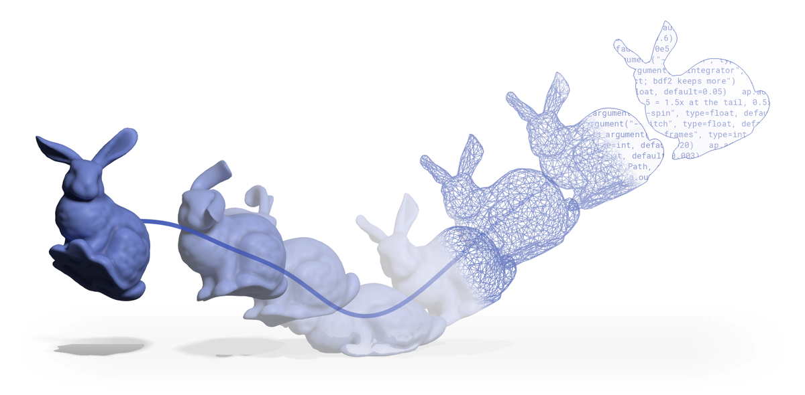
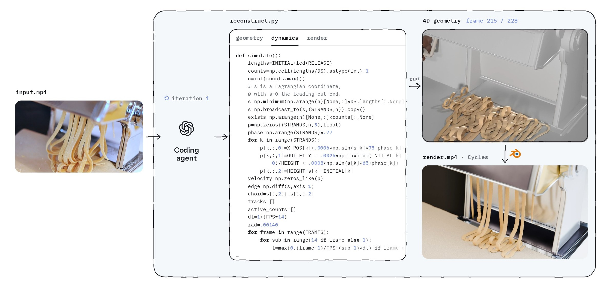

<p align="center">
    <picture>
        <source media="(prefers-color-scheme: dark)" srcset="./assets/logo_dark.png">
        
    </picture>
</p>

<h1 align="center">4DCodeBench: Benchmarking Agents on Inverse Graphics of Dynamic Scenes</h1>

<div align="center">
    <p>
        <a href="https://ruihong04.github.io/">Ruihong Shen</a><sup>1*†</sup>&nbsp;&nbsp;
        <a href="https://zzigak.github.io/">Žiga Kovačič</a><sup>2*</sup>&nbsp;&nbsp;
        <a href="https://kulits.github.io/">Peter Kulits</a><sup>3,2*</sup>&nbsp;&nbsp;
        <a href="https://xingruiwang.github.io/">Xingrui Wang</a><sup>1</sup>&nbsp;&nbsp;
        <a href="https://profiles.stanford.edu/zizhang-li">Zizhang Li</a><sup>2</sup>&nbsp;&nbsp;
        <a href="https://cocosci.mit.edu/josh-tenenbaum/">Joshua B. Tenenbaum</a><sup>4</sup>&nbsp;&nbsp;
        <a href="https://www.cs.jhu.edu/~ayuille/">Alan Yuille</a><sup>1</sup>&nbsp;&nbsp;
        <a href="https://beckschen.github.io/">Jieneng Chen</a><sup>2‡</sup>&nbsp;&nbsp;
        <a href="https://jiajunwu.com/">Jiajun Wu</a><sup>2‡</sup>
    </p>
    <p>
        <sup>1</sup>Johns Hopkins University &nbsp;&nbsp;&nbsp;
        <sup>2</sup>Stanford University &nbsp;&nbsp;&nbsp;
        <sup>3</sup>Max Planck Institute for Intelligent Systems &nbsp;&nbsp;&nbsp;
        <sup>4</sup>Massachusetts Institute of Technology
    </p>
    <p>
        <sup>*</sup> Equal contribution, listed in random order &nbsp;&nbsp;&nbsp;
        <sup>‡</sup> Equal co-advising &nbsp;&nbsp;&nbsp;
        <sup>†</sup> Work done during a summer internship.
    </p>
</div>

<p align="center">
    <a href='https://4dcodebench.com/' target="_blank">
        
    </a>
    <a href='https://huggingface.co/4DCodeBench' target="_blank">
        
    </a>
</p>



Can a coding agent watch a video of a physical event and write a program that reconstructs it? 4DCodeBench tests this on 200 videos: 100 real-world videos and 100 simulated videos. For each video, the agent writes graphics code to reproduce the scene's geometry, its motion over time, and its appearance in the rendered video.

The benchmark has two main stages. **Inference** runs a coding agent on a reference video and saves its submission. **Scoring** evaluates that submission against the reference. The harness is the set of scripts that launches these stages, supplies their inputs, and collects their outputs. A separate viewer lets you inspect the reconstructions and scores.

## Setup

### Clone the repository

```bash
git clone https://github.com/4DCodeBench/4DCodeBench
cd 4DCodeBench
```

Run the commands below from the repository root unless stated otherwise.

### Requirements

To run agents and score their submissions, you need an NVIDIA GPU and Python 3.11 or later on the host. The host runs the harness; the agent and scorer have their own environments.

- **Inference:** Docker with the NVIDIA Container Toolkit, or SingularityCE / Apptainer, to run the agent container. You also need credentials for the agent you choose; see [agent setup](docs/agent-setup.md).
- **Scoring:** the scorer container, or the [conda environment](#conda-environment) for running the scoring stages directly. Scoring also requires [model checkpoints](docs/checkpoints.md) for the models used to evaluate the reconstruction.
- **VLM-as-judge, if you use it:** an [OpenRouter API key](https://openrouter.ai/keys), set as `OPENROUTER_API_KEY`, and FFmpeg. This is a separate evaluation described [below](#vlm-as-judge).

### Build the container images

A container image packages the software needed to run a stage. The harness starts a container from that image for each agent run or scoring process, so those dependencies do not need to be installed on the host.

Inference uses the `agent` image, which includes the graphics tools, agent CLIs, and submission checker. Scoring uses a separate `scorer` image with the evaluation models' dependencies and visualization tools. The `sim-base` image supplies the shared graphics environment from which the agent image is built.

For Docker, build the images from the repository root:

```bash
docker build -t 4dcb/sim-base:dev -f harness/base/Dockerfile .
docker build -t 4dcb/agent:dev    -f harness/agent/Dockerfile .
docker build -t 4dcb/scorer:dev   -f harness/scorer/Dockerfile .
```

| Image | Used for | Included software |
|---|---|---|
| `sim-base` | Building the agent image | CUDA 13, Blender 5.2, and PyTorch |
| `agent` | Running coding agents | `sim-base`, agent CLIs, and the checker |
| `scorer` | Scoring submissions and generating visualizations | PyTorch with CUDA 13, OpenVDB, the scorer, and the visualizer |

If you are only running inference, build `sim-base` and `agent`. If you are scoring existing submissions, you need the scorer environment.

For SingularityCE / Apptainer, convert the runtime images to SIF files:

```bash
apptainer build 4dcb-agent-dev.sif docker-daemon://4dcb/agent:dev
apptainer build 4dcb-scorer-dev.sif docker-daemon://4dcb/scorer:dev
```

Set `backend = "sif"` in the runtime configuration and configure it to use the corresponding SIF files.

### Conda environment

You can also run the scorer, visualizer, and viewer in a conda environment. This uses the same package versions as the scorer image and supports [running the scoring stages directly](#running-the-stages-directly).

```bash
conda env create -f environment.yml
conda activate 4dcodebench
scripts/setup_env.sh
```

`environment.yml` installs Python 3.12, the CUDA 13.0 toolkit, FFmpeg, and OpenVDB. `scripts/setup_env.sh` then installs PyTorch and the pinned packages from `harness/scorer/requirements*.txt` using uv, compiles CUDA extensions for the local GPUs, and builds `scorer-vdb`.

## Download the data

Each benchmark case has a reference video for the agent and separate data for evaluation. Download both if you plan to run inference and scoring:

```bash
python scripts/download_data.py
```

If you only want to run agents, the reference videos are enough:

```bash
python scripts/download_data.py --videos-only
```

The script downloads [Dataset-Real-World](https://huggingface.co/datasets/4DCodeBench/Dataset-Real-World) and [Dataset-Synthetic](https://huggingface.co/datasets/4DCodeBench/Dataset-Synthetic) into `cases/` and `data/`. Add `--kind real` or `--kind synthetic` to download only one dataset. Files already in place are skipped, so you can resume an interrupted download by running the command again.

The download script requires `huggingface_hub`, `h5py`, `hdf5plugin`, `numpy`, `opencv-python`, and FFmpeg. The synthetic reference worlds occupy about 65 GB once unpacked.

### Where inputs and outputs are stored

The workflow uses three directories under the repository root:

- **`cases/`** holds the reference videos shown to agents.
- **`data/`** holds evaluation data, including reference geometry for synthetic cases and dynamic masks for real cases. The scoring preparation stage also writes its reference estimates here.
- **`runs/`** holds agent submissions, logs, scores, and visualizations.

```text
cases/<kind>/<case>/
└── reference.mp4
data/<kind>/<case>/
├── world/
├── annotation/
│   └── dynamic_mask.npz
└── estimates/
runs/<kind>/<case>/<agent>-<model>-<effort>/<trial>/
├── workspace/
│   ├── world/
│   └── solution/
├── logs/
├── session/
├── run.json
├── results/
└── viz/
```

Here, `<kind>` is `real` or `synthetic`, `<case>` identifies the video, and `<trial>` identifies a repeated run. In job configuration, the `case` field accepts either `<case>` or `<kind>/<case>`.

The agent receives only `reference.mp4` from the case files; evaluation data in `data/` is not mounted into its container. For synthetic cases, `data/<kind>/<case>/world/` contains the reference world. For real cases, `annotation/dynamic_mask.npz` contains the annotated dynamic mask. The `prepare` stage writes reference estimates to `estimates/`.

Each run saves the reconstructed world under `workspace/world/` and the agent's solution under `workspace/solution/`. Agent logs and CLI session transcripts go into `logs/` and `session/`. `run.json` records the command, exit status, wall time, token usage, cost, and step counts. Scoring writes to `results/`, and visualization writes to `viz/`.

## Run agents

### Configure the jobs and runtime

The inference and scoring harness commands each take two TOML files: one describes the runs you want, and the other describes how to run them on your machine. Copy the templates from `harness/runtime/templates/` into `.local/` and fill them in. The commands below use `.local/jobs.toml` and `.local/runtime.toml`.

| Argument | Configuration |
|---|---|
| `--jobs` | The cases, agents, models, effort settings, and trial count |
| `--runtime` | Data directories, container images, time limits, network settings, credentials, and checkpoint directory |

In the jobs file, each `[[job]]` entry specifies `case`, `agent`, `model`, and `effort`. The top-level `trials` value determines how many times each entry runs. An entry with its own `trial = N` runs only that trial.

### Set up agent credentials

Each agent needs access to its model provider. For agents that use a credential file, place or link that file under `.auth/`; the harness mounts it only into that agent's container. See [agent setup](docs/agent-setup.md) for login and credential-linking instructions.

| Agent | CLI | Credential file | Credential source |
|---|---|---|---|
| `claude` | Claude Code | `.auth/claude.json` | `~/.claude/.credentials.json` |
| `codex` | Codex CLI | `.auth/gpt.json` | `~/.codex/auth.json` |
| `antigravity` | Antigravity CLI | `.auth/gemini.json` | Antigravity OAuth token |
| `stirrup` | Artificial Analysis' Stirrup, for any OpenAI-compatible endpoint | None | `OPENAI_BASE_URL` and `OPENAI_API_KEY` under `[agent.stirrup.env]` |

### Start inference

```bash
python harness/runtime/infer.py --jobs .local/jobs.toml --runtime .local/runtime.toml
```

For each run, the harness starts an agent container with a read-only task description at `/task` and the reference video at `/input/reference.mp4`. The task description includes the required world format and render settings. The agent works in `/workspace`, which is empty at the start.

These are paths inside the container. When the container exits, the harness keeps only the agent's `world/` and `solution/` output directories from `/workspace` and places them in the run's `workspace/` directory on the host. See [the specification](docs/spec.md) for the submission format.

Jobs run sequentially, each with the whole GPU and the wall-clock limit set by `[agent] timeout_sec` (6 hours by default). Re-running a trial replaces that trial's previous run.

Add `--dry-run` to print the container commands without starting the runs.

The harness estimates cost using [LiteLLM's price table](https://github.com/BerriAI/litellm/blob/main/model_prices_and_context_window.json) at a pinned revision. If a model is missing from that table, its `cost_usd` is `null`.

## Score submissions

Scoring uses the saved submissions in `runs/` and the evaluation data in `data/`. Configure the scorer image and checkpoint directory in the runtime file, and make sure you have downloaded the evaluation data and [model checkpoints](docs/checkpoints.md).

On the first scoring pass, run both preparation and scoring:

```bash
python harness/runtime/score.py --jobs .local/jobs.toml --runtime .local/runtime.toml --stage prepare,score
```

The two stages do different work:

1. **`prepare`** computes reference estimates from each case's input video: optical flow, tracks, depth, a point map, and DINOv3 / TIPS features. These give the scorer reference measurements to compare with the reconstruction. They are stored in `data/<kind>/<case>/estimates/` and reused when scoring later runs of the same case.
2. **`score`** evaluates each submitted reconstruction and writes `reward.json`, `reward.detail.json`, and the arrays used by the metrics to that run's `results/` directory.

Once reference estimates exist, you can run scoring alone by omitting `--stage`; the default stage is `score`.

The harness splits runs across the GPUs listed in `CUDA_VISIBLE_DEVICES`. It starts one scorer container per GPU, and each container loads each model once for all of its runs.

### Scoring options

- **`--stage <stages>`:** choose a comma-separated list of `prepare`, `score`, and `viz`. Selected stages always run in that order. Use `prepare,score,viz` to also generate videos showing the reference, reconstruction, and errors for flow, tracks, depth, dynamic masks, and DINOv3 / TIPS features. These videos are saved in each run's `viz/` directory.
- **`--type <types>`:** recompute selected metric types, such as `trajectory,semantic`, while keeping the other entries in `results/`.
- **`--sanity`:** also score each synthetic case's reference world and save the results in `data/<kind>/<case>/sanity/`. This shows how the metrics score a perfect reconstruction.
- **`--dry-run`:** print the container commands without running them.

### Running the stages directly

If you use the [conda environment](#conda-environment), you can invoke the scorer and visualizer directly instead of launching them through `harness/runtime/score.py`. A JSON manifest tells these commands which worlds to evaluate and where to write their outputs.

For example, save the following as `manifest.json`:

```json
[{"case": "synthetic/B_01", "world": "runs/synthetic/B_01/claude-claude-opus-5-high/1/workspace/world",
  "out": "runs/synthetic/B_01/claude-claude-opus-5-high/1"}]
```

Replace the example with your case and run paths. World paths in the manifest must start with `cases/`, `data/`, or `runs/`.

From the repository root, with the conda environment active:

```bash
roots="--manifest manifest.json --cases cases --data data --checkpoints checkpoints"
python -m scorer.prepare $roots               # compute reference estimates, once per case
python -m scorer         $roots --runs runs   # write metrics to each run's results/
python -m visualizer     $roots --runs runs   # optionally write videos to each run's viz/
```

## VLM-as-judge

Alongside the metrics below, the paper uses two evaluations in which a vision-language model judges rendered videos: visual question answering (VQA) and pairwise preference. In VQA, the judge answers questions about the videos; in pairwise evaluation, its preferences are used to compute Elo ratings.

The code in `vlm_judge/` runs these evaluations using videos in `cases/` and `runs/`. It requires FFmpeg and an OpenRouter API key:

```bash
export OPENROUTER_API_KEY=...
python3 vlm_judge/judge.py vqa      --system <agent>-<model>-<effort> --out answers.jsonl
python3 vlm_judge/judge.py score    answers.jsonl
python3 vlm_judge/judge.py pairwise --out pairs.jsonl
python3 vlm_judge/judge.py elo      pairs.jsonl
```

Replace `<agent>-<model>-<effort>` with the system directory name used in your runs. The `vqa` command saves the judge's answers, and `score` scores those answers. The `pairwise` command saves preference judgments, and `elo` computes ratings from them.

To compare a new system with the systems in the paper, download their renders and place them under `runs/` before running the pairwise evaluation:

```bash
hf download 4DCodeBench/Results --repo-type dataset --local-dir results
python scripts/place_renders.py results
```

See [the VLM-as-judge README](vlm_judge/README.md) for prompts, gates, and scoring rules.

## Inspect results in the viewer

The viewer is a read-only web interface for comparing reconstructions with their reference videos and inspecting scores. Start it from the repository root:

```bash
python viewer/server.py --port 8130
```

Then open [http://localhost:8130](http://localhost:8130). The server requires Python with `numpy` and `h5py`; the conda environment provides these dependencies.

By default, the viewer reads `cases/`, `data/`, and `runs/` under the repository root. Use `--cases`, `--data`, and `--runs` to point it at different directories.

- **Case view:** compare the render with the reference, watch the `viz/` videos, inspect submitted meshes and trajectories in 3D, and view per-frame measurements.
- **Results:** compare metrics averaged per model and effort setting.
- **Metrics:** read the definition of each metric.

## Metrics

The metrics compare appearance, geometry, and motion. Real-world cases use video-based reference estimates and annotations; synthetic cases also provide reference worlds for 3D comparisons. The table shows which metrics apply to each dataset and the keys used in `reward.json`.

| Family | Metric | `reward.json` key | Cases |
|---|---|---|---|
| Perceptual | DINOv3 similarity | `semantic_dinov3` | All |
| 2D Dynamics | Flow | `flow_distribution` | Real |
| | Track2D | `track2d_dtw` | Real |
| | Dynamic IoU | `dynamic_iou` | All |
| 2.5D Geometry | Depth error (lower is better) | `depth_error` | Real |
| 3D Geometry | Scene 3D | `scene_3d` | Synthetic |
| 3D Dynamics | Trajectory DTW | `trajectory_dtw` | Synthetic |
| | EMD step | `emd_step` | Synthetic |
| Additional | TIPS similarity, GeoPhys DINOv3 | `semantic_tips`, `geophys_dinov3` | All |
| | Uni3D MoGe | `uni3d_moge_scene` | Real |
| | Uni3D point, Occupancy DTW | `uni3d_point_scene`, `occupancy_dtw` | Synthetic |
| Geometry quality | Watertight, manifold, non-degenerate, no self-intersection, no interpenetration | `mesh_*`, `interpenetration` | All |

All metrics range from 0 to 1, with higher values indicating better results, except depth error, which ranges from 0 to 2 and is lower-is-better. If a metric does not apply or cannot be computed, it records a state instead of a number: `not_applicable`, `excluded`, `error`, or `uncomputable`. See [the evaluation specification](docs/spec.md#evaluation) for definitions, gates, and states.

## Repository layout

| Directory | Contents |
|---|---|
| `harness/` | Container build files, the task description given to agents (`agent_context/`), and the inference and scoring launchers (`infer.py` and `score.py`) |
| `checker/` | Public world-format checker, installed in the agent image |
| `scorer/` | Scoring code, installed in the scorer image; `prepare/` computes reference estimates |
| `visualizer/` | Code for generating scored runs' `viz/` videos, installed in the scorer image |
| `viewer/` | Read-only web viewer for scored runs |
| `vlm_judge/` | VQA and pairwise evaluations, prompts, and question set |
| `config/` | Constants shared by the checker and scorer |
| `scripts/` | `download_data.py`, `download_checkpoints.sh`, `setup_env.sh` (conda setup), and `place_renders.py` (the paper's renders for VLM-as-judge) |
| `docs/` | [World format and metrics](docs/spec.md), [agent setup](docs/agent-setup.md), and [model checkpoints](docs/checkpoints.md) |

## Citation

```bibtex
@article{shen20264dcodebench,
  title={{4DCodeBench}: Benchmarking Agents on Inverse Graphics of Dynamic Scenes},
  author={Shen, Ruihong and Kova{\v{c}}i{\v{c}}, {\v{Z}}iga and Kulits, Peter and Wang, Xingrui and Li, Zizhang and Tenenbaum, Joshua B. and Yuille, Alan and Chen, Jieneng and Wu, Jiajun},
  journal={arXiv preprint arXiv:2610.03715},
  year={2026}
}
```
